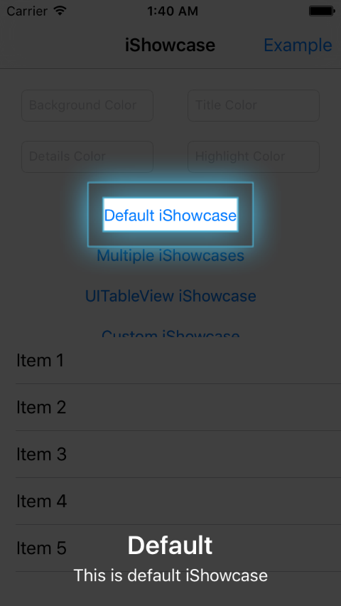
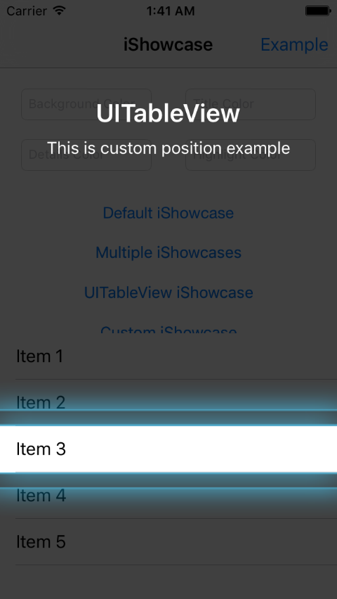
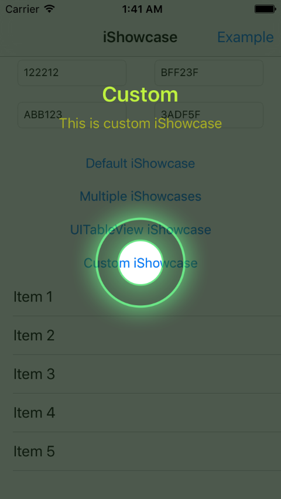
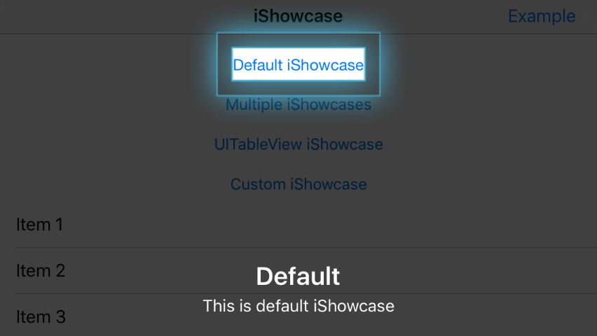
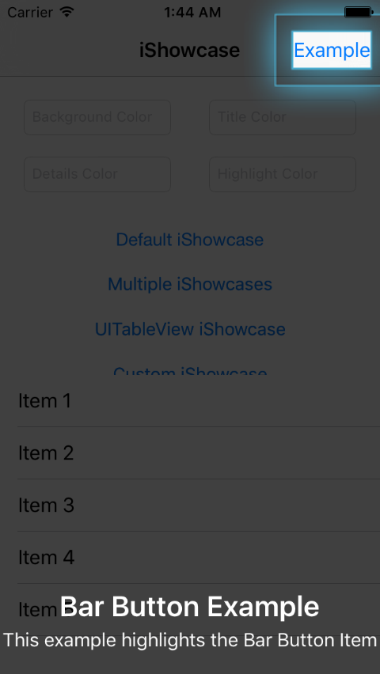

# iShowcase

Highlight individual parts of your application using iShowcase

[](https://travis-ci.org/rahuliyer95/iShowcase)
[](http://cocoadocs.org/docsets/iShowcase)
[](http://cocoadocs.org/docsets/iShowcase)
[](http://cocoadocs.org/docsets/iShowcase)
[](http://www.github.com/rahuliyer95/iShowcase/issues?state=open)



## Requirements
* iOS 7.0 or higher
* ARC

## Installation

iShowcase is available through [CocoaPods](http://cocoapods.org). To install
it, simply add the following line to your Podfile:

    pod "iShowcase", "~> 2.0"

or

### Swift
  * Add `iShowcase.swift` file to your project

## [Documentation](http://rahuliyer95.github.io/iShowcase/docs)

## Usage

To run the example project, clone the repo, and run `pod install` from the Example directory first.

#### Creating Instance

``` swift
// Create Object of iShowcase
let showcase = iShowcase()
```

#### Delegate

``` swift
showcase.delegate = self;
```

#### Delegate Methods

``` objective-c
iShowcaseShown // Called When Showcase is displayed
iShowcaseDismissed // Called When Showcase is removed
```

#### Displaying iShowcase

``` swift
showcase.setupShowcaseForView(view: UIView)
showcase.titleLabel.text = "Default"
showcase.detailsLabel.text = "This is default iShowcase!"
showcase.show()

// For custom location

setupShowcaseForLocation(location: CGRect)

// Methods for other UI Elements

setupShowcaseForTableView(tableView: UITableView)
setupShowcaseForTableView(tableView: UITableView, withIndexPath: NSIndexPath)
setupShowcaseForTableView(tableView: UITableView, withIndexOfItem: Int, andSectionOfItem: Int)
setupShowcaseForBarButtonItem(barButtonItem: UIBarButtonItem)
```

#### Customizations

``` swift
public enum TYPE: Int {
    case CIRCLE = 0
    case RECTANGLE = 1
}

titleLabel: UILabel
detailsLabel: UILabel
coverColor: UIColor
coverAlpha: CGFloat
highlightColor: UIColor
type: TYPE
radius: Float
singleShotId: Int64
```

## Screenshots






## Credits

Inspired from [ShowcaseView](https://github.com/amlcurran/Showcaseview) by [Alex Curran](https://github.com/amlcurran/)

## Author

rahuliyer95, rahuliyer573@gmail.com

## License

iShowcase is available under the MIT license. See the [LICENSE](LICENSE) file for more info.
